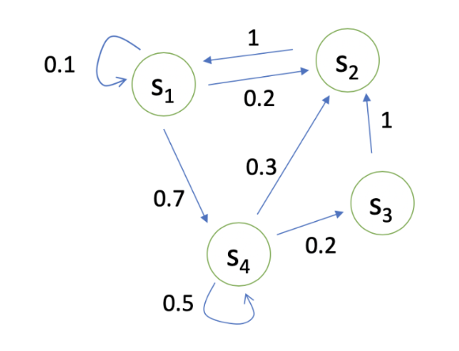

# Markov Decision Process

## Markov Process

### Markov Property
State $s_t$ is Markovian if and only if:
$$p(s_{t+1} \vert s_t) = p(s_{t+1} \vert s_t, s_{t-1},\dots, s_1)$$
$$p(s_{t+1} \vert s_t, a_t) = p(s_{t+1} \vert s_t, s_{t-1},\dots, s_1, a_t)$$

### Markov Chain

State transition matrix $P$ specifies $p(s_{t+1} =s' \vert s_t = s)$
$$P = 
\begin{bmatrix} p(s_1 \vert s_1) & p(s_1 \vert s_2) & p(s_1 \vert s_3) & p(s_1 \vert s_4) \\\\\\ 
p(s_2 \vert s_1) & p(s_2 \vert s_2) & p(s_2 \vert s_3) & p(s_2 \vert s_4) \\\\\\ 
p(s_3 \vert s_1) & p(s_3 \vert s_2) & p(s_3 \vert s_3) & p(s_3 \vert s_4) \\\\\\ 
p(s_4 \vert s_1) & p(s_4 \vert s_2) & p(s_4 \vert s_3) & p(s_4 \vert s_4) \end{bmatrix}$$

## Markov Reward Process
Markov Reward Process is a Markov Chain + reward.

### Definition
+ $S$ is a (finite) set of states ($s \in \mathcal{S}$).
+ $P$ is a dynamics/transition model that specifies $P(S_{t+1} = s' \vert s_t = s)$.
+ $R$ is a **reward function**, $R(s_t = s) = \mathbb{E}[r_t \vert s_t = s]$
+ Discount factor $\gamma \in [0, 1]$

### Horizon
Number of maximum time steps in each episode. 

### Return
Discounted sum of rewards from time step $t$ to horizon.
$$G_t = R_{t+1} + \gamma R_{t+2} + \gamma^2 R_{t+3} + \dots + \gamma^{T-t-1}R_T$$

### State value function for MRP
Expected return from $t$ in state $s$.
$$\begin{aligned} V_t(s) &= \mathbb{E} \left[ G_t \vert s_t = s \right] \\ &= \mathbb{E} \left[ R_{t+1} + \gamma R_{t+2} + \gamma^2 R_{t+3} + \dots + \gamma^{T-t-1}R_T \vert s_t = s \right] \end{aligned}$$

### Discount factor
+ Avoid infinite returns in cyclic Markov processes.
+ Uncertainty about the future may not be fully represented.
    + $\gamma = 0$: Only care about the immediate reward.
    + $\gamma = 1$: Future reward is equal to the immediate reward.

### Bellman Equation
$$ V(s) = R(s) + \gamma \sum_{s, \in S} P(s' \vert s) V(s') $$

**Proposition 1**: MRP value function satisfies the Bellamn equation.

**Prove**: 

$$\begin{aligned} 
V_t(s) &= \mathbb{E} \left[ G_t \vert s_t = s \right] \\\\\\
&= \mathbb{E} \left[ R_{t+1} + \gamma R_{t+2} + \gamma^2 R_{t+3} + \dots + \gamma^{T-t-1}R_T \vert s_t = s \right] \\\\\\
&= \mathbb{E} \left[ R_{t+1} + \gamma (R_{t+2} + \gamma R_{t+3} + \dots + \gamma^{T-t-2}R_T) \vert s_t = s \right] \\\\\\
&= \mathbb{E} \left[ R_{t+1} + \gamma G_{t+1} \vert s_t = s \right] \\\\\\
&= R_{t+1} + \gamma \mathbb{E} \left[ G_{t+1} \vert s_t = s \right] \\\\\\
&= R_{t+1} + \gamma \sum_{s_{t+1} \in S} P(s_{t+1} \vert s) V(s_{t+1}) 
\end{aligned}$$

#### Matrix Form for MRP
$$V = R + \gamma PV$$
$$V = (I - \gamma P)^{-1} R$$
+ Matrix inverse take $O(N^3)$ for $N$ states.
+ Only possible for small MRPs.

### Iterative Algorithm for Computing Value of a MRP
+ Dynamic Programming
+ Monte-Carlo evaluation
+ Temporal-Difference learning

## Markov Decision Process

### Definition
Markov Decision Process is Markov Reward Process with decisions.
+ $S$ is a finite set of states
+ $A$ is a finite set of actions
+ $P(s_{t+1}=s' \vert s_t = s, a_t = a)$ is a dynamics/transition model for each action
+ $R(s_t = s, a_t = a) = \mathbb{E} \left[ r_t \vert s_t = s, a_t = a \right]$
+ MDP is a tuple: $(S, A, P, R, \gamma)$

### Policy
Policy specifies what action to take in each state. Give a state, specify a distribution over actions.
$$\pi(a \vert s) = P(a_t = a \vert s_t = s)$$

### State value function and action value function
$$q^{\pi}(s, a) = \mathbb{E}_{\pi} \left[ G_t \vert s_t = s, a_t = a \right]$$

$$v^{\pi}(s) = \sum_{a \in A} \pi(a \vert s) q^{\pi} (s, a)$$

### Bellman Expectation Equation
**Proposition 2**: The state value function adn action value function can be decomposed as

$$
\begin{aligned}
v^{\pi}(s) &= \mathbb{E}\_{\pi} \left[ G_t \vert s_t = s\right] \\\\\\
&= \mathbb{E}\_{\pi} \left[ R_{t+1} + \gamma v^{\pi}(s_{t+1}) \vert s_t = s\right] \\\\\\
&= \sum_{a \in A} \pi(a \vert s) \left( R(s, a) + \gamma \sum_{s' \in S}P(s' \vert s, a ) v^{\pi}(s') \right) 
\end{aligned}$$

$$
\begin{aligned}
q^{\pi}(s, a) &= \mathbb{E}\_{\pi} \left[ G_t \vert s_t = s, a_t = a\right] \\\\\\
&= \mathbb{E}\_{\pi} \left[ R_{t+1} + \gamma q^{\pi}(s_{t+1}, a_{t+1}) \vert s_t = s, a_t = a\right] \\\\\\
&= R(s, a) + \gamma \sum_{s' \in S} P(s' \vert s, a) \sum_{a' \in A} \pi(a' \vert s') q^{\pi}(s', a')
\end{aligned}
$$

**Prove**:

For state value function $v(s)$
$$ V(s) = R(s) + \gamma \sum_{s, \in S} P(s' \vert s) V(s') $$
And,

$$v^{\pi}(s) = \sum_{a \in A} \pi(a \vert s) q^{\pi} (s, a)$$
$$P^{\pi}(s \vert s') = \sum_{a \in A} \pi(a \vert s) P^{\pi} (s, a)$$
$$R^{\pi}(s) = \sum_{a \in A} \pi(a \vert s) R^{\pi} (s' \vert s, a)$$

Hence, 

$$ \sum_{a \in A} \pi(a \vert s) q^{\pi} (s, a) = \sum_{a \in A} \pi(a \vert s) R^{\pi} (s, a) + \gamma \sum_{s' \in S} \sum_{a \in A} \pi(a \vert s) P^{\pi} (s' \vert s, a) V(s') $$
$$ v^{\pi}(s) = \sum_{a \in A} \pi(a \vert s) R^{\pi} (s, a) + \gamma \sum_{s' \in S} \sum_{a \in A} \pi(a \vert s) P^{\pi} (s' \vert s, a) V(s') $$
$$q^{\pi}(s, a) = R(s, a) + \gamma \sum_{s' \in S} P(s' \vert s, a) v^{\pi}(s')$$

Since 
$$v^{\pi}(s) = \sum_{a \in A} \pi(a \vert s) q^{\pi} (s, a)$$
$$v^{\pi}(s') = \sum_{a' \in A} \pi(a' \vert s') q^{\pi} (s', a')$$
$$q^{\pi}(s, a) = R(s, a) + \gamma \sum_{s' \in S} P(s' \vert s, a) \sum_{a' \in A} \pi(a' \vert s') q^{\pi} (s', a')$$