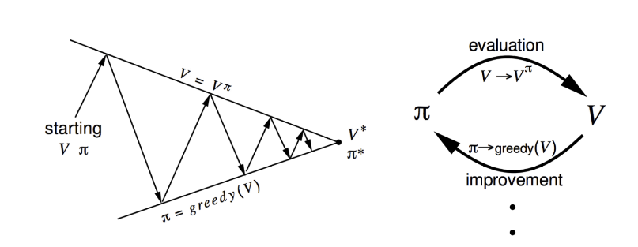
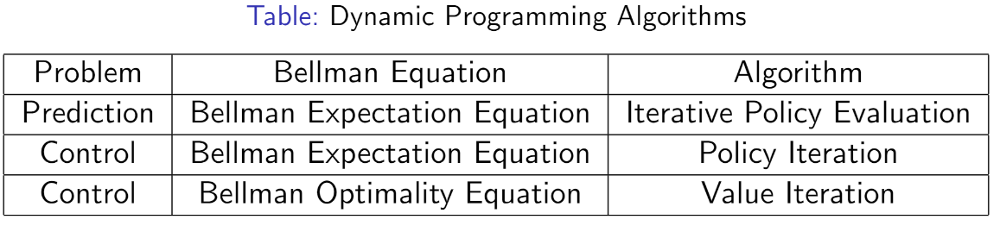

## Evaluation
+ Objective: Evaluate a given policy $\pi$ for a MDP
+ Output: The value function under policyu $v^{\pi}$

### Dynamic Programming
+ Solution: iteration on Bellman expectation backup.
+ Algorithm: Synchronous  backup
+ At each iteration $t+1$, update $v_{t+1}(s)$ from $v_t(s')$ for all states $s \in S$ where $s'$ is a successor state of $s$. $$v_{t+1}(s) = \sum_{a \in A} \pi(a \vert s) \left( R(s, a) + \gamma \sum_{s' \in S} P(s' \vert s, a) v_t(s') \right)$$

## Control
### Optimal Value Function
The optimal state-value function $v^\*(s)$ is the maximum value function over policies
$$v^*(s) = \max_{\pi} v^{\pi}(s)$$

The optimal policy is
$$\pi^*(s) = \arg\max_{\pi} v(s)$$

### Policy Iteration

#### Policy Evaluation
+ Compute $v(s)$ given current $\pi(s)$
$$v_{t+1}(s) = \sum_{a \in A} \pi(a \vert s) \left( R(s, a) + \gamma \sum_{s' \in S} P(s' \vert s, a) v_t(s') \right)$$

#### Policy Improvement
+ Compute the state-action value of a policy $\pi$ $$q^{\pi_i}(s, a) = R(s, a) + \gamma \sum_{s' \in S} P(s' \vert s, a) v^{\pi_i}(s')$$
+ Compute new policy $\pi_{i+1}$ for all $s \in S$ following $$\pi_{i+1}(s) = \arg\max_a q^{\pi_i}(s, a)$$

**Proposition 1**: In policy iteration, policy is monotonically improved.

**Proved**:
Since the policy is improved through
$$\pi'(s) = \arg\max_a q^{\pi}(s, a)$$
$$q^\pi(s, \pi'(s)) = \max_{a \in A} q^{\pi}(s, a) \geq v^\pi(s)$$

Since $v^{\pi}(s)$ is an expectation of all state action value function at current state.

Hence
$$
\begin{aligned}
v^{\pi}(s) &\leq q^{\pi}(s, \pi'(s)) \\\\\\
&= \mathbb{E}[R_{t+1} + \gamma v^{\pi}(s_{t+1}) \vert s_t = s, a_t = \pi'(s)] \\\\\\
&= \mathbb{E}_{\pi'}[R_{t+1} + \gamma v^{\pi}(s_{t+1}) \vert s_t = s] \\\\\\
&\leq \mathbb{E}_{\pi'}[R_{t+1} + \gamma q^{\pi}(s_{t+1}, \pi'(s_{t+1})) \vert s_t = s] \\\\\\
&= \mathbb{E}_{\pi'}[R_{t+1} + \gamma \mathbb{E}[R_{t+2} + \gamma v^{\pi}(s_{t+2}) \vert s_t = s_{t+1}, a_t = \pi'(s_{t+1})] \vert s_t = s] \\\\\\
&= \mathbb{E}_{\pi'}[R_{t+1} + \gamma R_{t+2} + \gamma^2 v_\pi(s_{t+2}) \vert s_t = s] \\\\\\
&\leq \mathbb{E}_{\pi'}[R_{t+1} + \gamma R_{t+2} + \gamma^2 R_{t+3} + \gamma^3 v_\pi(s_{t+3}) \vert s_t = s] \\\\\\
& \vdots \\\\\\
&\leq  \mathbb{E}_{\pi'}[R_{t+1} + \gamma R_{t+2} + \gamma^2 R_{t+3} + \gamma^3 R_{t+4} \vert s_t = s] \\\\\\
&= v^{\pi'}(s)
\end{aligned}
$$

Hence the policy is monotonically improved in the policy iteration stage.

### Value Iteration
If improvements stop,
$$q^{\pi}(s, \pi'(s)) = \max_{a \in A} q^{\pi} (s, a) = q^{\pi}(s, \pi(s)) = v^{\pi}(s)$$

Thus, the Bellman optimality equation has been satisifed
$$v^{\pi}(s) = \max_{a \in A} q^{\pi} (s, a)$$

Therefore, $v^*(s) = v^{\pi}(s)$ for all $s \in S$, so $\pi$ is an optimal policy.

#### Bellman Optimality Equation
Because
$$v^*(s) = \max_{a \in A}q^*(s, a)$$
$$q^*(s, a) = R(s, a) + \gamma \sum_{s' \in S} P(s\ \vert s, a) v^*(s')$$

So
$$v^*(s) = \max_{a \in A} R(s, a) + \gamma \sum_{s' \in S} P(s\ \vert s, a) v^*(s')$$
$$q^*(s, a) = R(s, a) + \gamma \sum_{s' \in S} P(s\ \vert s, a) \max_{a \in A}q^*(s', a')$$

#### Algorithm
+ Objective: find the optimal policy $\pi$.
+ Solution: iteration on the Bellman optimality backup.
+ Value Iteration algorithm:
    + initialize $k=1$ and $v_0(s) = 0$ for all states $s$
    + For $k = 1: H$
        + for each state $s$, $$q_{k+1}(s, a) + \gamma \sum_{s' \in S} P(s' \vert s, a) v_k(s')$$ $$v_{k+1}(s) = \max_a q_{k+1}(s, a)$$
        + $k \leftarrow k+1$
    + Finally, to retrieve the optimal policy after the value iteration: $$\pi(s) = \arg\max_a R(s, a) + \gamma \sum_{s' \in S} P(s' \vert s, a) v_{k+1}(s')$$

### Difference between Policy Iteration and Value Iteration
+ Policy iteration includes: **policy evaluation** + **policy improvement**, and the two area repeated iteratively until policy converges.
+ Value iteration includes: **finding optimal value function** + **one policy extraction**. There is no repeat of the two because once the value function is optimal, then the policy out of it should also be optimal (i.e., converged).

## Summary for Evaluatin and Control in MDP
