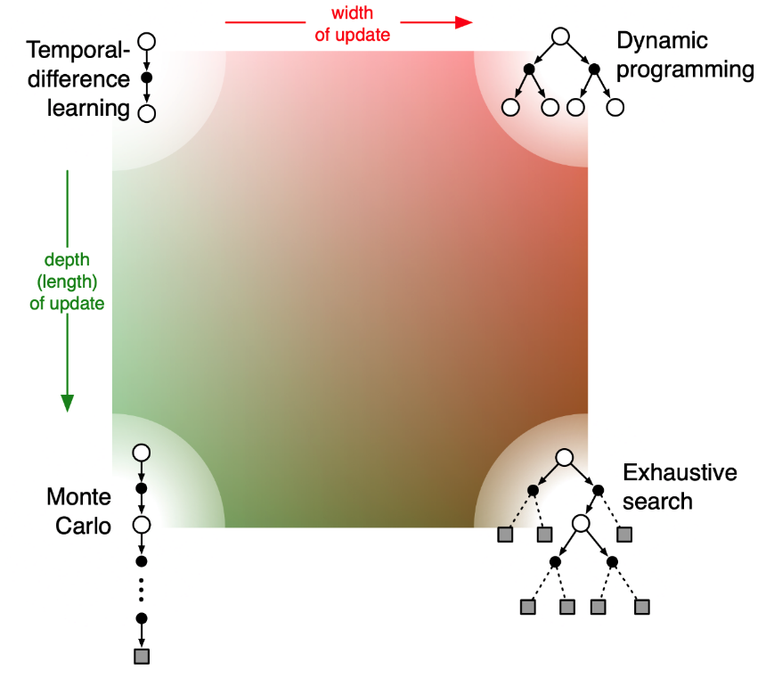
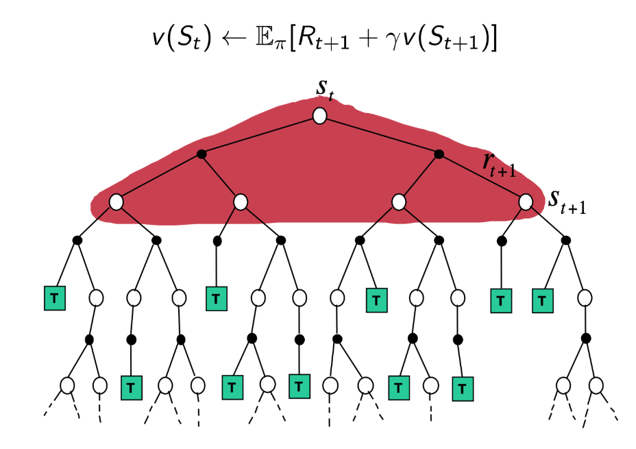
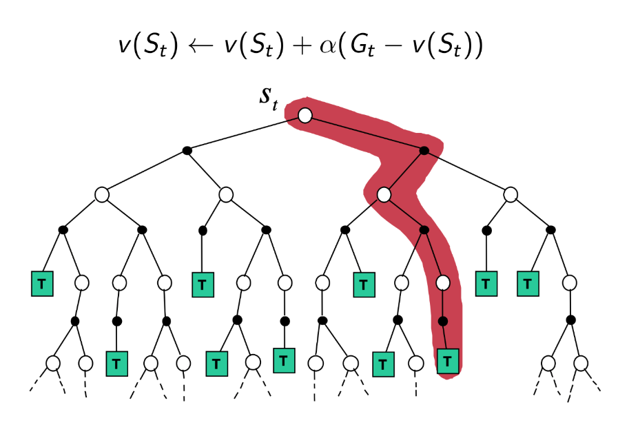
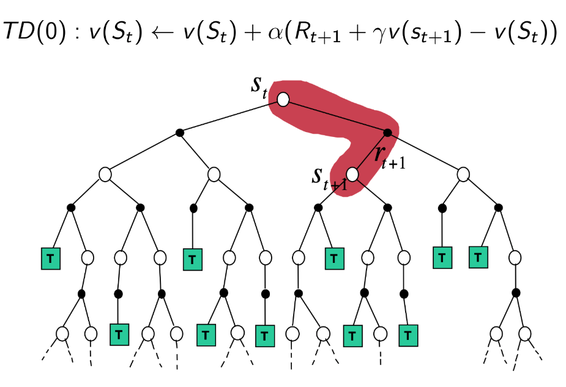
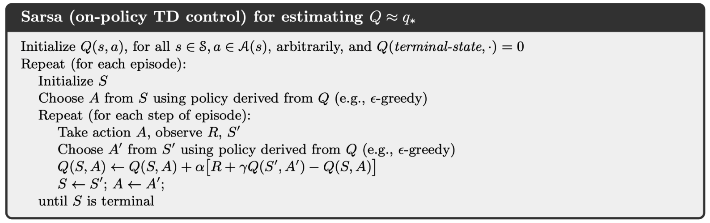
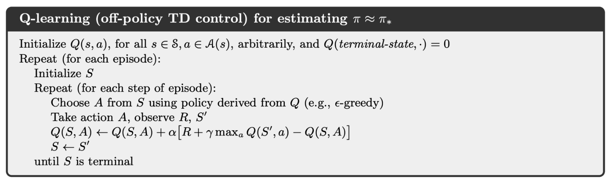
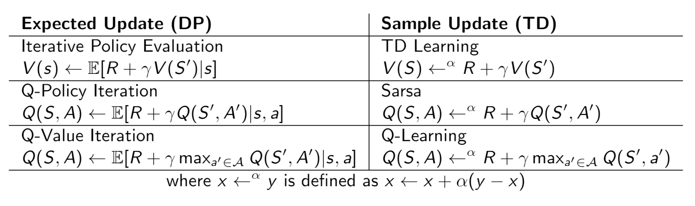
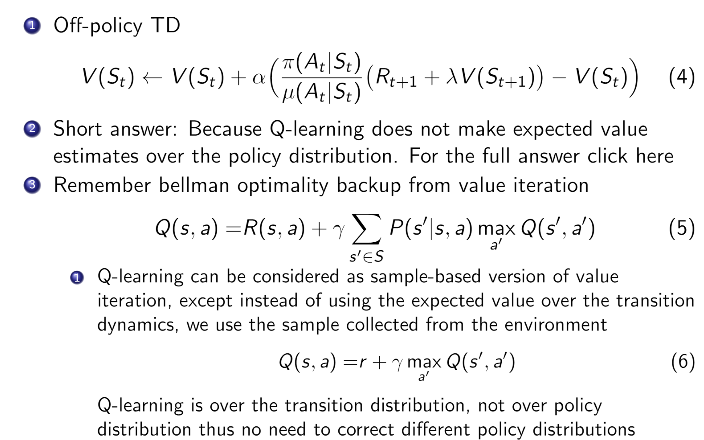

## Model-based and Model-free
For model-based learning, the state transition matrix $P(s' \vert s, a)$ is known. But for the model-free learning, the state transition matrix is unknown for us. Trajectories/episodes are collected by the agent's interaction with the environment.

## Evaluation
### Monte Carlo policy evaluation
#### Original algorithm
+ To evaluate state $v(s)$
    + Every time-step $t$ that state $s$ is visited in episode.
    + Increment counter $N(s) \leftarrow N(s) + 1$
    + Increment total return $S(s) \leftarrow S(s) + G_t$
    + Value is estimated by mean return $v(s) = S(s) / N(s)$
+ By law of large numbers, $v(s) \rightarrow v^\pi(s)$ as $N(s) \rightarrow \inf$

#### Improvement
Mean from the average of samples $x_1, x_2, \dots$
$$
\begin{aligned}
\mu_t &= \frac{1}{t} \sum_{j=1}^{t} x_j \\\\\\
&= \frac{1}{t} (x_t + \sum_{j=1}^{t-1} x_j) \\\\\\
&= \frac{1}{t} (x_t + (t-1) \mu_{t-1}) \\\\\\
&= \frac{x_t}{t} + \frac{t-1}{t} \mu_{t-1} \\\\\\
&= \mu_{t-1} + \frac{1}{t} (x_t - \mu_{t-1})
\end{aligned}
$$

Hence
+ Collect one episode $(S_1, A_1, R_1, \dots, S_t)$
+ For ech state $s_t$ with computed return $G_t$
$$
\begin{aligned}
N(S_t) \leftarrow N(S_t) + 1 \\
v(S_t) \leftarrow v(S_t) + \frac{1}{N(S_t)}(G_t - v(S_t))
\end{aligned}
$$
+ Or use a running mean (old episodes are forgotten). Good for non-stationary problems
$$v(S_t) \leftarrow v(S_t) + \alpha (G_t - v(S_t))$$

### Temporal Difference (TD) learning
+ TD methods learn directly from episodes of experience
+ TD is model-free: no knowledge of MDP transitions/rewards
+ TD learns from incomplete episodes, by bootstrapping

#### Algorithm
+ Objective: learn $v_\pi$ online from experience under policy $\pi$.
+ Simplest TD algorithm: $TD(0)$
    + Update $v(S_t)$ toward estimated return $R_{t+1} + \gamma v(S_{t+1})$. $$v(S_t) \leftarrow v(S_t) + \alpha (R_{t+1} + \gamma v(S_{t+1}) - v(S_t))$$
+ $R_{t+1} + \gamma v(S_{t+1})$ is called TD target
+ $R_{t+1} + \gamma v(S_{t+1}) - v(S_t)$ is called TD error

### Comparison for MC and TD
| Feature | MC | TD |
| ---- | ---- | ---- |
| Update | TD can learn online after every step | MC must wait until end of episode before reutrn is known |
| Sequence | TD learn from incomplete sequences | MC can only learn from complete sequences |
| Environment | TD works in continuing (non-terminating) environments | MC only works for episodic (terminating) environment |
| Markovian | TD exploits Markov property, more efficient in Markov environments | MC does not exploit Markov property, more effective in non-Markov environments

when $n \rightarrow \inf$, $TD(n)$ equals to MC

### Comparison for DP, MC and TD
#### Comparison

#### DP

#### MC

#### TD

## Control

### $\epsilon$-Greedy Expoloration
+ Trade-off between exploration and exploitation
+ $\epsilon$-Greedy Expoloration
    + All actions are tried with non-zero probability
    + With probability $1 - \epsilon$ choose the greedy action
    + With probability $\epsilon$ choose an action at random
    
$$
\pi(a \vert s) = 
\begin{cases}
\epsilon / \vert A \vert + 1 -\epsilon& \text{if} a^* = \arg\max_{a \in A} Q(s, a) \\\\\\
\epsilon / \vert A \vert & \text{otherwise}
\end{cases}
$$

### Generalized Policy Iteration (GPI) with MC

#### Policy Improvement
**Proposition 1**: Policy improvement theorem: For any $\epsilon$-greedy policy $\pi$, the $\epsilon$-greedy policy $\pi'$ with respect to $q_\pi$ is an improvement, $v_{\pi'}(s) \geq v_{\pi}(s)$

**Proved**:
$$
\begin{aligned}
q\_{\pi}(s, \pi'(s)) &= \sum\_{a \in A} \pi'(a \vert s) q\_{\pi}(s, a) \\\\\\
&= (\frac{\epsilon}{|A|} + 1 - \epsilon) \max_a q\_\pi(s, a) + \frac{\epsilon|A-1|}{|A|^2} \sum_{a \in A} q\_\pi(s, a \vert \text{a is not argmax}) \\\\\\
&= (1 - \epsilon) \max\_a q\_{\pi}(s, a) + \frac{\epsilon}{|A|} \sum\_{a \in A} q\_{\pi}(s, a) \\\\\\
&\geq (1 - \epsilon) \frac{1}{|A|}\sum_{a \in A} q\_\pi(s, a) + \frac{\epsilon}{|A|}\sum_{a \in A} q\_\pi(s, a) \\\\\\
&= (1 - \epsilon) \sum_{a \in A} \frac{\pi(a \vert s) - \frac{\epsilon}{|A|}}{1 - \epsilon} q\_{\pi}(s, a) + \frac{\epsilon}{|A|}\sum_{a \in A} q\_\pi(s, a) \\\\\\
&= \sum_{a \in A} \pi(a \vert s) q\_{\pi}(s, a) = v\_\pi(s)
\end{aligned} 
$$

Therefore, $v_{\pi'}(s) \geq v_{\pi}(s)$ from the policy improvement theorem.

#### Algorithm

### Generalized Policy Iteration (GPI) with TD

#### SARSA (On policy TD control)
When we evaluate the state function through TD, the update function is
$$v(s_t) \leftarrow v(s_t) + \alpha (R_{t+1} + \gamma v(s_{t+1}) - v(s_t))$$

Similarly, when we update the action value function through TD, the udpate function is
$$q(s_t, a_t) \leftarrow q(s_t, a_t) + \alpha (R(s, a) + \gamma q(s_{t+1}, a_{t+1}) - q(s_t, a_t))$$

#### Q-Learning (Off policy TD control)
+ The target policy $\pi$ is greedy on $Q(s, a)$ $$\pi(s_{t+1}) = \arg\max_{a'}q(s_{t+1}, a')$$
+ The behavior policy $\mu$ could be totally random, but we let it improve following $\epsilon$-greedy on $q(s, a)$
+ Thus, Q-learning target is, $$\begin{aligned} R_{t+1} + \gamma Q(s_{t+1}, a') &= R_{t+1} + \gamma Q(s_{t+1}, \arg\max_{a'}Q(s_{t+1}, a')) \\ &= R_{t+1} + \gamma \max_{a'} Q(s_{t+1}, a') \end{aligned}$$
+ Thus, the Q-Learning update $$Q(s_t, a_t) \leftarrow Q(s_t, a_t) + \alpha (R_{t+1} + \gamma \max_a(s_{t+1}, a) - Q(s_t, a_t))$$

## Summary of DP and TD

## Comparison of on-policy and off-policy

### Behavior policy
Behavior policy is the policy that the agent uses to determine its actions (behavior) in a given state.

### Target Policy
Target policy is the policy that the agent uses to learn from the rewards received for its actions, i.e., to determine updated Q value.

### Comparison
If the target policy is different from behavior policy, then the agent is called **off-policy** learner.

If the target policy is same as behavior policy, then the agent is called **on-policy** learner.

## Important Sampling
+ Estimate the expectation of a function 
$$E_{x \sim P}[f(x)] = \int p(x) f(x) dx \approx \frac{1}{n} \sum_i f(x)$$
+ Sometimes it is difficult to sample $x$ from $p(x)$, then we can sample $x$ from another distribution $q(x)$, then correct the weight
$$
\begin{aligned}
E_{x \sim P}[f(x)] &= \int p(x) f(x) dx \\\\\\
&= \int q(x) \frac{p(x)}{q(x)} f(x) dx \\\\\\
&= E_{x \sim q}\left[\frac{p(x)}{q(x)}f(x)\right] \\\\\\
&\approx \frac{1}{n} \sum_i \frac{p(x)}{q(x)}f(x)
\end{aligned}
$$

### Important sampling for off-policy
+ Estimate the expectation of return using trajectories sampled from another policy (behavior policy)
$$
\begin{aligned}
E_{T \sim \pi}[g(T)] &= \int p(T) g(T) dT \\\\\\
&= \int q(T) \frac{p(T)}{q(T)} f(T) dT \\\\\\
&= E_{T \sim \mu}\left[\frac{p(T)}{q(T)}f(T)\right] \\\\\\
&\approx \frac{1}{n} \sum_i \frac{p(T_i)}{q(T_i)}f(T_i)
\end{aligned}
$$

### Important sampling for Off-policy Monte Carlo
**Only need sample once**
+ Generate episode from behavior policy $\mu$ and compute the generated return $G_t$ $$s_1, a_1, r_1, s_2, \dots t_t \sim \mu$$
+ Weight return $G_t$ according to similarity between policies.
    + Multiply importance sampling corrections along whole episode $$G_t^{\pi/\mu} = \frac{\pi(a_t \vert s_t) \pi(a_{t+1} \vert s_{t+1})}{\mu(a_t \vert s_t) \mu(a_{t+1} \vert s_{t+1})} \cdots \frac{\pi(a_T \vert s_T)}{\mu(a_T \vert s_T)}$$
+ Update value towards correct return $$v(s_t) \leftarrow v(s_t) + \alpha (G_t^{\pi / \mu} - v(s_t))$$

### Important sampling for Off-policy Temporal Difference
**Only need sample once**
+ Use TD targets generated from $\mu$ to evaluate $\pi$
+ Weight TD target $R + \gamma v(s')$ by importance sampling
+ Only need a single importance sampling correction $$v(s_t) \leftarrow v(s_t) + \alpha \left(  \frac{\pi(a_t \vert s_t)}{m(a_t \vert s_t)} (r_{t+1} + \gamma v(s_{t+1}) - v(s_t))\right)$$
+ Policies only need to be similar over a single step
### *Pros and Cons of Importance Sampling
+ pros: Do not need sample multiple times, enhance the efficiency.
+ Get unbiased return as on-policy methods.

cons: High variance, sometimes can not converge.

### Why not use IS in Q-learning?
