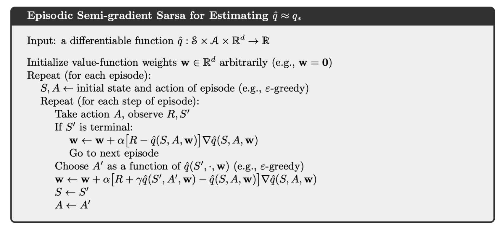
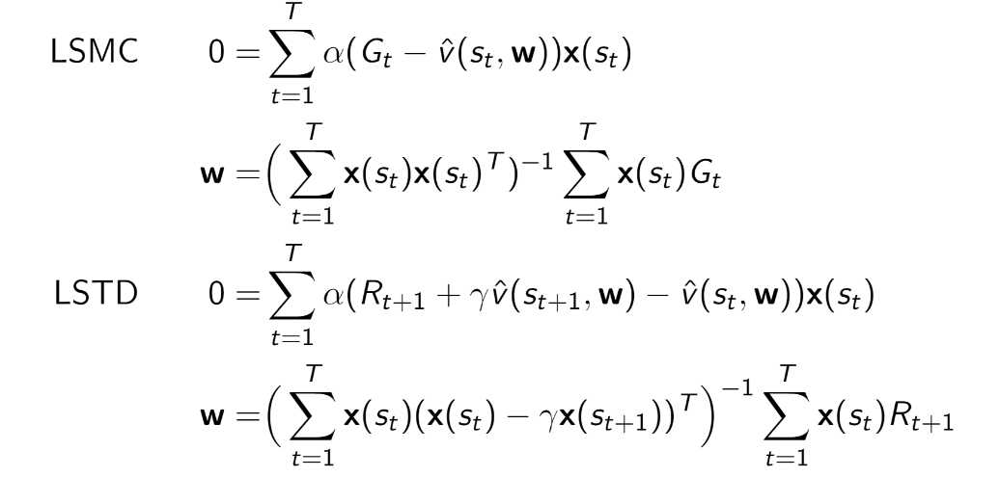
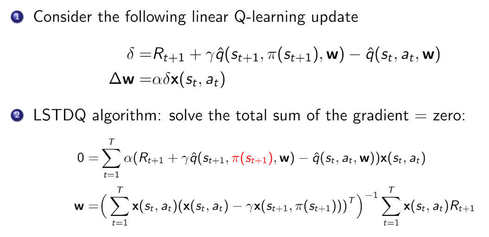
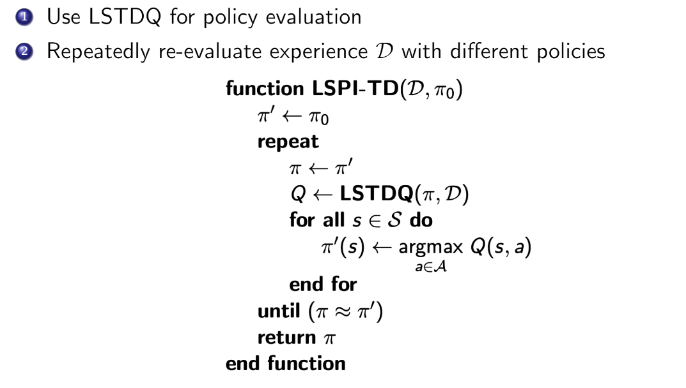

## Introduction
**Why function approximation?**

In a small scale RL tasks, we can use lookup-table to represent the value function for each state. But for complex RL tasks like Go or robots, the state and action space is tremendous. (for Go,  it has $10^{170}$ states; for robot, the state and action has continuous space, nearly infinity space for control and prediction). How to avoid explicitly learning or storing for every single state is a question for us to consider.

### Solution
**Estimate with function approximation** $\rightarrow$ Generalizing fro seen stats to unseen states. 
$$
\begin{aligned}
\hat{v}(s, \omega) &\approx v^{\pi}(s) \\\\\\
\hat{q}(s, a, \omega) &\approx a^{\pi}(s, a) \\\\\\
\hat{\pi}(a, s, \omega) &\approx \pi(a \vert s)
\end{aligned}
$$

+ Supposing we have a value function represented by a lienar combination of features $$\hat{v}(s, \omega) = x(s)^T \omega$$ where $x(s)$ is a encoding function of state.
+ The objective function is quadratic in parameter $\omega$ $$J(w) = \mathbb{E}_{\pi} \left[ (v^{\pi}(s) - x(s)^T \omega)^2 \right]$$
+ Thus the update rule is as simple as $$\Delta \omega = \alpha (v^{\pi}(s) - \hat{v}(s, \omega))x(s)$$
+ Stochastic gradient descent converges to global optimum. Because in the linear case, there is only one optimum, thus local optimum is automatically converge to or near the global optimum.

#### Special case: Approximation with Table Lookup Feature
+ Table lookup fewature is one-hot vector as follows $$x^{\text{table}}(s) = \left( 1(s == s_1), \dots, 1(s == s_n) \right)$$
+ Then we can see that each element on the parameter vector $\omega$ indicates the value of each individual state $$\hat{v}(s, \omega) = \left( 1(s == s_1), \dots, 1(s == s_n) \right) (w_1, \dots, w_n)^T$$
+ Thus we have $\hat{v}(s_k, \omega) = w_k$

## Value function approximation for prediction
We assumed that true value function $v^{\pi}(s)$ givenby supervisor / oracle
$$\Delta \omega = \alpha \left( v^{\pi}(s) - \hat{v}(s, \omega)\right) \nabla_w \hat{v}(s_t, \omega) $$
### MC
For MC, the target is the actual return G_t
$$\Delta \omega = \alpha \left( G_t - \hat{v}(s, \omega)\right) \nabla_w \hat{v}(s_t, \omega) $$
+ **High variance, unbiased**: Return $G_t$ is an unbiased, but noisy sample of true value $v^{\pi}(s_t)$
+ Why high variance?
    + For each step in MC, we got an error, so the total error of $G_t$ is is $T\epsilon$, where $T$ is the horizon and $\epsilon$ is the expection of erro in each step.
+ Why unbiased?
    + According to the definition of state value function, $v_{\pi} = \mathbb{E}[G_t \vert s_t = s]$. Hence it is unbiased.

### TD
For TD(0), the target is the TD target $R_{t+1} + \gamma \hat{v}(s_{t+1}, \omega)$
$$\Delta \omega = \alpha \left( R_{t+1} + \gamma \hat{v}(s_{t+1}, \omega) - \hat{v}(s, \omega)\right) \nabla_w \hat{v}(s_t, \omega) $$
+ **Low variance, biased**: TD target $R_{t+1} + \gamma \hat{v}(s_{t+1}, \omega)$ is a biased sample of true value $v^{\pi}(s_t)$
+ Why low variance?
    + Because we only got one step in each iteration, hence the error is $\epsilon$ instead of $T\epsilon$.
+ Why biased? (from silver slides)
    + The return of $G_t = R_{t+1} + \dots + \gamma_{T-1}R_T$ is unbiased estimation of $v_{\pi}(s_t)$
    + The **True TD target** $R_{t+1} + \gamma v_{\pi}(s_{t+1})$ is unbiased estimation of $v_{\pi}(s_t)$. According to the definition of $G_t$, $v_{\pi}(s_{t+1}) = \mathbb{E}[G_t \vert s_{t+1} = s]$. Hence it is unbias3ed estimation of $v_{\pi}(s_t)$
    + TD target $R_{t+1} + \gamma v(s_{t+1})$ is biased estimation of $v_{\pi}(s_t)$. Hence $v(s_{t+1}) \neq v_{\pi}(s_{t+1})$, and it is high-correlated with the initially value of $v(s_{t+1})$
+ It is also called as semi-gradient, as we ignore the effect of changing the wieght vector $\omega$ on the target.

## Value function approximation for control
### Generalized policy iteration
+ Policy evaluation: approximate policy evaluation, $\hat{q}(*,*, \omega) \approx q^{\pi}$
+ Policy improvement: $\epsilon$-greedy policy improvement

### Incremental Control Algorihtm
+ For MC, the target is return $G_t$ $$\Delta \omega = \alpha (G_t - \hat{q}(s_t, a_t, \omega)) \nabla_w \hat{q}(s_t, a_t, \omega)$$
+ For Sarsa, the target is TD target $R_{t+1} + \gamma \hat{q}(s_{t+1}, a_{t+1}, \omega)$ $$\Delta \omega = \alpha (R_{t+1} + \gamma \hat{q}(s_{t+1}, a_{t+1}, \omega) - \hat{q}(s_t, a_t, \omega)) \nabla_w \hat{q}(s_t, a_t, \omega)$$
+ For Q-learning, the target is TD target $R_{t+1} + \gamma \max_a \hat{q}(s_{t+1}, a, \omega)$ $$\Delta \omega = \alpha (R_{t+1} + \gamma \max_a \hat{q}(s_{t+1}, a, \omega) - \hat{q}(s_t, a_t, \omega)) \nabla_w \hat{q}(s_t, a_t, \omega)$$

#### Example: Semi-gradient Sarsa for VFA Control

## Convergence of Control Methods
### The deadly triad for the danger of instability and divergence
+ **Function approximation**: A scalable way of generalizing from a state space much larger than the memory and computational resources.
+ **Bootstrapping**: Update targets that include existing estimates (as in dynamic programming or TD methods) rather than relying exclusively on actual rewards and complete returns (as in MC methods)
+ **Off-policy training**: training on a distribution of transitions other than that produced by the target policy.

### Convergence of TD
+ TD with VFA doesn't follow the gradient of any objective function.
+ The updates involve doing an approximate Bellman backup followed by fitting the underlying value function.
+ That is why TD can diverge when off-policy of using non-linear funciton approximation
+ Challenge foroff-policy control: behavior policy and target policy are not identical, thus value function approximation can diverge.

| Algorithm | Table Lookup | Linear | Non-Linear |
| ---- | ---- | ---- | ---- |
| Monte-Carlo Control | &check; | (&check;) | &cross; |
| Sarsa | &check; | (&check;) | &cross; |
| Q-Learning | &check; | &cross; | &cross; |

(below from Sutton slides https://media.nips.cc/Conferences/2015/tutorialslides/SuttonIntroRL-nips-2015-tutorial.pdf)
+ If the function approximator is linear, it is
    + guaranteed convergent for prediction (fixed target policy)
    + guaranteed non-divergent for control, with bounded error.
+ On-policy methos typically perform better than **off-policy** methods, but find **poor policies**.
+ For Q-learning
    + it can be generalized of function approximation, and often it works well.
    + It may be possible to guarantee convergence of Q-learning as long as the behavior policy is sufficiently close to the target policy, for example, when it is the $\epsilon$-greedy policy. To the best of our knowledge, Q-learning has never been found to diverge in this case.
    + However, there are counterexamples, simple examples where the parameters diverge to infinity, even for lienar function approximation.

## Batch Reinforcement Learning
+ Incremental gradient descend update is simple, but it is not sample efficient
+ Batch-based methods seek to find the best fitting value function for a batch of the agent's experience.
### Algorithm
+ Given the value function approximation $\hat{v}{s, \omega} \approx v^{\pi}(s)$
+ The experience $D$ consisiting of <state, value> pairs (may from one episode or many previous episodes) $$D = \{<s_1, v_1^{\pi}>, \dots, <s_T, v_T^{\pi}>\}$$
+ Objective: To optimize the parameter $\omega$ that best fit all the experience $D$
+ Least squares algorithms are used to minimize the sum-squared error between $\hat{v}(s_t, \omega)$ and the target value $v_t^\pi$ 
$$
\begin{aligned}
\omega^* &= \arg\min_{\omega} \mathbb{E}_D [v^\pi - \hat{v}(s, \omega)^2] \\
&= \arg\min_{\omega} \sum_{t=1}^T (v_t^\pi - \hat{v}(s_t, \omega))^2
\end{aligned}
$$
+ We can use stochastic gradient descent to minimize the least square prediction error.

## Least square Methods
### Least square prediction
**Movtivation**: 
Experience replay finds least squares solution, but it may take many iterations

**Solution**
+ Using linear value function approximation $\hat{v} (s, \omega) = x(s)^T w$, we can solve the elast squares solutin directly. 
+ Let the expected value of the gradient of $\omega$ be 0.
+ For $N$ states, the matrix ivnersion complexity is $O(N^3)$ 

### Least square control
+ For policy evaluation, we want to efficiently use all the experinece.
+ For control we want to improve the policy
+ The experience is generated from many policies (previous old policies)
+ So to evaluate $q^{\pi}(s, a)$, we must learn off-policy
+ We follow the sme idae of Q-Learning:
    + Use the experience generated by old policy: $$s_a, a_t, r_{t+1}, s_{t+1} \sim \pi_{\text{old}}$$
    + Consider the alternative successor action $a'= \pi_{\text{new}}(s_{t+1})$ using greedy.
    + Update $\hat{q}(s_t, a_t, \omega)$ towards value of alternative action $t_{t+1} + \gamma \hat{q}(s_{t+1}, a', \omega)$

| Algorithm | Table Lookup | Linear | Non-Linear |
| ---- | ---- | ---- | ---- |
| Monte-Carlo Control | &check; | (&check;) | &cross; |
| Sarsa | &check; | (&check;) | &cross; |
| Q-Learning | &check; | &cross; | &cross; |
| LSPI | &check; | (&check;) |- |