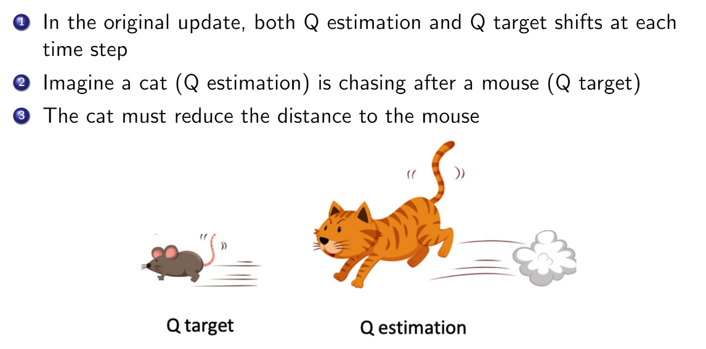

## Deep Q networks
+ Two of the issues in Q learning with Vlaue Function Approximation
    + Correlations between samples
    + Non-stationary targets
+ Deep Q-learning (DQN) addresses both of these challenges by
    + Experience replay
    + Fixed Q targets

### Experience Replay
**Objective**: To reduce the correlations among samples, store transition $(s_t, a_t, r_t, s_{t+1})$ in replay memory $D$.

**Solution**:
To perform experience replay, repeat the following:
+ Sample an experience tuple from the dataset: $(s, a, r, s') \sim D$
+ Compute the target value for the sampled tuple: $r + \gamma \max_{a'} Q(s', a', \omega)$
+ Use stochastic gradient descent to update the network weights $$\Delta \omega = \alpha (R_{t+1} + \gamma \max_a \hat{q}(s_{t+1}, a, \omega) - \hat{q}(s_t, a_t, \omega)) \nabla_w \hat{q}(s_t, a_t, \omega)$$

### Fixed Targets
**Objective**: To help improve stability.

fix the target weights used in the target calculation for multiple updates

**Solution**: Fix the target weights used in the target calculation for multiple updates
+ Let a different set of parameter $\omega^-$ be the set of weights used in the target, and $\omega$ be the weights that are being updated.
+ To perfomr experience replay with fixed target, repeat the following
    + Sample an experience tuple from the dataset: $(s, a, r, s') \sim D$
    + Compute the target value for the sampled tuple: $r + \gamma max_{a'} \hat{Q}(s', a', \omega^-)$
    + Use stochastic gradient decent to update the network weights $$\Delta \omega = \alpha (R_{t+1} + \gamma \max_a \hat{q}(s_{t+1}, a, \omega^-) - \hat{q}(s_t, a_t, \omega)) \nabla_w \hat{q}(s_t, a_t, \omega)$$