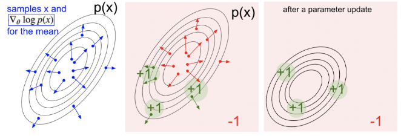

## Introduction of Polcy-based reinforcement learning
+ Value-based RL
    + Deterministic Policy
    + To learn value function
    + Implicit policy based on the value function.
+ Policy-based RL
    + No value function
    + To learn policy directly
    + More stochastic policy
+ Actor-critic
    + To learn both policy and value function

### Advtantages of Policy-based RL
#### Advantages
+ Better convergence properties: guarantee to converge on a local optimum (worst case) or global optimum (best case)
+ Policy gradient is more effective in high demensional action space.
+ Policy gradient can learn stochastic policies, while value function can't.

#### Disadvantages
+ Typically converges to a local optimum.
+ Evaluating a policy has high variance.

## Policy-based Reinforcement

### Objective of Optimizing Policy
**Objective**: Given a policy approximator $\pi_\theta(s, a)$ with parameter $\theta$
To measure the quality of a policy $\pi_\theta$

+ In episodic environments, we can use the start value $$J_1(\theta) = V^{\pi_{\theta}}(s_1) = \mathbb{E}_{\pi_\theta} [v_1]$$
+ In continuing environments, can use either average state value or the average reward per time-step
    + $$J_{avgV}(\theta) = \sum_s d^{\pi_\theta}(s) V^{\pi_\theta}(s)$$
    + $$J_{avgR}(\theta) = \sum_s d^{\pi_\theta}(s) \sum_a \pi_\theta(s, a) R(s, a)$$
    + $d^{\theta_\pi}$ is stationary distribution of Markov chain for $\pi_\theta$. We can understand it as the sample probability when we run an epsiode.
+ The value of the policy is defined as $$ \begin{aligned} J(\theta) &= \mathbb{E}\_{\tau \sim \pi\_\theta} \left[ \sum\_t R(s_t^\tau, a\_t^\tau) \right] \\\\\\ &\approx \frac{1}{m} \sum\_m \sum\_t R(s\_t^m, a\_t^m) \end{aligned} $$
    + $\tau$ is a trajectory sampled from the policy funtion $\pi_\theta$
    + Here we ignore the discount factor $\gamma$ for now.
+ The goal of policy-based RL $$\theta^* = \arg\max_\theta \mathbb{E}_{\tau \sim \pi_\theta} \left[ \sum_t R(s_t^\tau, a_t^\tau) \right]$$
+ If $J(\theta)$ is differentiable, we can use gradient-based methods:
    + gradient ascend
    + conjugate gradient
    + quasi-newton
+  If $J(\theta)$ is not differentiable or is hard to compute the derivative, some derivative-free black-box optimization methods can be used:
    + Cross-entropy method (CEM)
    + Hill climbing
    + Evolution algorithm

### Policy Optimization using Derivative
+ Define the gradient of $J(\theta)$ ot be $$\nabla_\theta J(\theta) = \left( \frac{\partial J(\theta)}{\partial \theta_1}, \frac{\partial J(\theta)}{\partial \theta_2}, \dots, \frac{\partial J(\theta)}{\partial \theta_n} \right)^T$$

#### Derivative-free Method
##### Cross-Entropy Method

##### Finite Difference

#### Derivative-based Method
+ Assume policy $\pi_\theta$ ia differentiable whenever it is non-zero
+ We can compute the gradient $\nabla_\theta \pi_\theta (s, a)$ by using the following tricks $$\begin{aligned} \nabla_\theta \pi_\theta (s, a) &= \pi_\theta (s, a) \frac{\nabla_\theta \pi_\theta(s, a)}{\pi_\theta(s, a)} \\\\\\ &= \pi_\theta (s, a) \nabla_\theta \log \pi_\theta (s, a) \end{aligned}$$
+ The score function is $\nabla_\theta \log \pi_\theta (s,a)$

### Policy Example
#### Softmax Policy (can be used for discrete action space)
+ Simple policy model: Weight actions using linear combination of features $\phi(s, a)^T \theta$
+ Probability of action is proportional to the exponetiated weight $$\pi_\theta(s, a) = \frac{\exp^{\phi(s, a)^T \theta}}{\sum_{a'} \exp^{\phi(s, a')^T \theta}}$$
+ The score function is $$\nabla \log \pi_\theta(s, a) = \phi(s, a) - \mathbb{E}_{\pi_\theta} \left[ \phi(s, .) \right]$$

#### Gaussian Policy (can be used for continous action space)
+ Mean is a linear combination of state features $\mu(s) = \phi(s)^T\theta$
+ Variance may be fixed $\sigma^2$ or can also be parameterized
+ Policy is Gaussian, the continuous $a \sim \mathcal{N}(\mu(s), \sigma^2)$
+ The score function is $$\nabla_\theta \log \pi_\theta (s, a) = \frac{(a - \mu(s)) \phi(s)}{\sigma^2}$$

## Monte Carlo Policy Gradient
### Policy gradient for One-step MDPs
Using likelihood ratios to compute the policy gradient 
$$
\begin{aligned}
J(\theta) &= \mathbb{E}\_{\pi\_\theta} [r] \\\\\\ 
&= \sum\_{s \in S} d(s) \sum\_{a \in A} \pi\_\theta (s, a)r 
\end{aligned}
$$

The gradient is
$$
\begin{aligned}
\nabla_\theta J(\theta) &= \sum_{s \in S} d(s) \sum_{a \in A} \nabla\pi_\theta (s, a)r \\\\\\
&= \sum_{s \in S} d(s) \sum_{a \in A} \pi_\theta (s, a)\nabla_\theta \log \pi_\theta(s, a) r \\\\\\
&= \mathbb{E}_{\pi_\theta} [r \nabla_\theta \log \pi_\theta(s, a)]
\end{aligned}
$$

### Policy gradient for Multi-step MDPs
+ Denote a state-action trajectory from one episdoe as $\tau = (s_0, a_1, r_1, \dots, s_{T-1}, a_{T-1}, r_{T-1}, s_T) \sim (\pi_\theta, P(s_{t+1} \vert s_t, a_t))$
+ Denote $R(\tau) = \sum_{t=0}^{T-1} R(s_t, a_t)$ as the sum of rewards over a trajectory $\tau$
+ The policy objective is $$J(\theta) = \mathbb{E}\_{\pi\_\theta} \left[ \sum\_{t=0}^{T-1} R(s\_t, a\_t) =\sum\_\tau p(\tau; \theta) r(\tau) \right]$$ where $p(\tau; \theta) = \mu(s\_0) \prod\_{t=0}^{T-1} \pi\_\theta(a\_t \vert s\_t) p(s\_{t+1} \vert s\_t, a\_t)$ denotes the probability over trajecotries when exexuting the policy $\pi_\theta$
+ The goal is to findthe policy parameter $\theta$
+ To calculate the gradient with respect to $\theta$
$$
\begin{aligned}
\nabla_\theta J(\theta) &= \nabla_\theta \sum_\tau P(\tau; \theta) R(\tau) \\\\\\
&= \sum_\tau \nabla_\theta P(\tau; \theta) R(\tau) \\\\\\
&= \sum_\tau P(\tau; \theta) R(\tau) \nabla_\theta \log P(\tau; \theta) \\\\\\
&\approx \frac{1}{m} \sum_\tau R(\tau) \nabla_\theta \log P(\tau; \theta) \\\\\\
\end{aligned}
$$

$$
\begin{aligned}
\nabla_\theta \log P(\tau; \theta) &= \nabla_\theta \log \left[ \mu(s_0) \prod_{t=0}^{T-1} \pi_\theta (a_t \vert s_t) p(s_{t+1} \vert s_t ,a_t) \right] \\\\\\
&= \nabla_\theta \left[ \log \mu(s_0) + \sum_{t=0}^{T-1} \log \pi_\theta (a_t \vert s_t) + \log p(s_{t+1} \vert, s_t, a_t) \right] \\\\\\
&= \sum_{t=0}^{T-1} \nabla_\theta \log \pi_\theta (a_t \vert s_t)
\end{aligned}
$$

Hence, 
$$\nabla_\theta J(\theta) \approx \frac{1}{m} \sum_{i=1}^{m}R(\tau_i) \sum_{t=0}^{T}\nabla_\theta \log \pi_\theta (a_t^i \vert s_t^i)$$

### Understanding Score Function Gradient Estimator
+ Consider the generic form of $E_{\tau \sim \pi_\theta}\left[ R(\tau) \right]$ as $$\begin{aligned} \nabla_\theta \mathbb{E}_{p(x; \theta)}[f(x)] &= \nabla_\theta \mathbb{E}_{p(x; \theta)} \left[ f(x) \nabla_\theta \log p(x; \theta) \right] \\\\\\ &= \frac{1}{S} \sum_{s=1}^{S} f(x_s) \nabla_\theta \log p(x_s; \theta) \end{aligned}$$ , where x_s \sim p(x; \theta)
+ The above gradient can be understood as:
    + Shift teh distribution $p$ through its parameter $\theta$ to let its future samples $x$ achieve hgiher scores as judged by $f(x)$
    + The directionof $f(x)\nabla_\theta \log p(x; \theta)$ pushes up the log likelihood of the sample, in proportion to hwo good it is.

#### Comparison to Maximum Likelihood
**Policy gradient can be regarded as a weighted averaged sum of the maximum likelihood estimator to maximize the return**
+ Policy gradient estimator $$\nabla_\theta J(\theta) \approx \frac{1}{M} \sum_{m=1}^{M} \left( \sum_{t=1}^T \nabla_\theta \log \pi_\theta (a_t^m \vert s_t^m) \right) \left( \sum_{t=1}^T r(s_t^m, a_t^m) \right)$$
+ Maximum likelihood estimator $$\nabla_\theta J_{ML}(\theta) \approx \frac{1}{M} \sum_{m=1}^{M} \left( \sum_{t=1}^T \nabla_\theta \log \pi_\theta (a_t^m \vert s_t^m) \right)$$
+ Good action is made mroe likely, bad action is made less likely.

## Reduce the Variance of Policy Gradient
The $\nabla\_\theta J(\theta)$ is **Unbiased but very noisy**, we have two possible refinements.
+ Use temporal causality
+ Include a baseline

### Use temporal causality

$$
\begin{aligned}
\nabla_\theta J(\theta) &= \mathbb{E}_\tau \left[ \left( \sum_{t=0}^{T-1} r_t \right) \left( \sum_{t=0}^{T-1} \nabla_\theta \log_{\pi_\theta}(a_t \vert s_t) \right) \right] \\\\\\
&= \mathbb{E}_\tau \left[\sum_{t=0}^{T-1} \left(\nabla_\theta \log_{\pi_\theta}(a_t \vert s_t) \sum_{t=0}^{T-1} r_t \right) \right] \\\\\\
&= \mathbb{E}_\tau \left[\sum_{t=0}^{T-1} \left(\nabla_\theta \log_{\pi_\theta}(a_t \vert s_t) \sum_{\color{red}t'=t}^{T-1} r_{t'} \right) \right] \\\\\\
&= \mathbb{E}_\tau \left[\sum_{t=0}^{T-1} G_t \nabla_\theta \log_{\pi_\theta}(a_t \vert s_t) \right] \\\\\\
\end{aligned}
$$

$G_t$ is the reuturn for a trajectory at step $t$, From the second line to the third line, the equation omit the part of $\sum_{t=0}^{t'} r_t$. This is because of causality.
+ **Causality**: policy at time $t'$ cannot affect reward at time t when $t < t'$

Hence, the rest part is called "reward to go". The provement is complicated, but can be found in OpenAI spinning up materials[^1],[^2]

[^1]: https://spinningup.openai.com/en/latest/spinningup/extra_pg_proof1.html
[^2]:https://spinningup.openai.com/en/latest/spinningup/rl_intro3.html#expected-grad-log-prob-lemma

Then we can have the following estimated update
$$\nabla_\theta J(\theta) = \frac{1}{m} \sum_{i=1}^m \sum_{t=0}^{T-1} G_t^i \nabla_\theta \log_{\pi_\theta}(a_t^i \vert s_t^i)$$

The algorithm is called **REINFORCE** algorithm

### Use a baseline
The original update
$$\nabla_\theta \mathbb{E}_{\tau \sim \pi_\theta} = \mathbb{E}_{\tau} \left[ \sum_{i=1}^m \sum_{t=0}^{T-1} G_t \nabla_\theta \log_{\pi_\theta}(a_t \vert s_t) \right]$$

We subtract a baseline $b(s)$ from the policy gradient to reduce variance
$$\nabla_\theta \mathbb{E}_{\tau \sim \pi_\theta}[R] = \mathbb{E}_{\tau} \left[ \sum_{t=0}^{T-1} ({\color{red} G_t - b(s_t)}) \nabla_\theta \log \pi_\theta (a_t \vert s_t) \right]$$

A good baseline is the expected return
$$b(s_t) = \mathbb{E} \left[ r_t + r_{t+1} + \dots + r_{T-1} \right]$$

+ Interpretation: increase  the log probability of action $a_t$ proportional to how much returns $G_t$ are better than the expected return

**Proposition 1**: The baseline $b(s)$ can reduce variance, without changing the expectation:
$$\mathbb{E}\_\tau \left[ \nabla\_\theta \log \pi\_\theta (a\_t \vert s\_t) b(s\_t) \right] = 0$$
$$\mathbb{E}\_\tau \left[ \nabla\_\theta \log \pi\_\theta (a\_t \vert s\_t) (G\_t - b(s\_t)) \right] = \mathbb{E}\_\tau \left[ \nabla\_\theta \log \pi\_\theta (a\_t \vert s\_t) G\_t \right]$$
$$Var\_\tau \left[ \nabla\_\theta \log \pi\_\theta (a\_t \vert s\_t) (G\_t - b(s\_t)) \right] < Var\_\tau \left[ \nabla\_\theta \log \pi\_\theta (a\_t \vert s\_t) G\_t \right]$$

**Prove**:

**EGLP Lemma**: Supposing that $P_\theta$ is a parameterized probability distribution over a random variable $x$, Then
$$\mathbb{E}_{x \sim P_\theta}[\nabla_\theta \log p_\theta(x)] = 0$$

**Prove for the Lemma**:

For all probability distributions, they have
$$\int_x p_\theta(x) = 1$$
$$\nabla_\theta \int_x p_\theta(x) = \nabla_\theta 1 = 0$$
$$
\begin{aligned}
0 &= \nabla_\theta \int_x p_\theta(x) \\\\\\
&= \int_x \nabla_\theta p_\theta (x) \\\\\\
&= \int_x \nabla_\theta p_\theta (x) \log p_\theta (x) \\\\\\
\end{aligned}
$$

Hence
$$\mathbb{E}\_{x \sim P_\theta}[\nabla_\theta \log p_\theta(x)] = 0$$

For this problem,
$$
\begin{aligned}
\mathbb{E}\_\tau \left[ \nabla_\theta \log \pi_\theta (a_t \vert s_t) b(s_t) \right] &= \sum_{s \in S} d_{\pi_\theta}(s) \sum_{a} \nabla_\theta \pi_\theta(s, a) b(s_t) \\\\\\
&= \sum_{s \in S} d_{\pi_\theta}(s) b(s_t) \nabla_\theta \sum_{a} \pi_\theta(s, a)  \\\\\\
&= \sum_{s \in S} d_{\pi_\theta}(s) b(s_t) \nabla_\theta 1 \\\\\\
&= 0
\end{aligned}
$$

For the variance, since $G_t - b(s_t) < G_t$ when $b_t > 0$ and $\mathbb{E}\_\tau \left[ \nabla_\theta \log \pi_\theta (a_t \vert s_t) b(s_t) \right] = 0$

Hence, 
$$\mathbb{E}\_\tau \left[ \nabla_\theta \log \pi_\theta (a_t \vert s_t) (G_t - b(s_t)) \right] = \mathbb{E}_\tau \left[ \nabla_\theta \log \pi_\theta (a_t \vert s_t) G_t \right]$$
$$Var_\tau \left[ \nabla_\theta \log \pi_\theta (a_t \vert s_t) (G_t - b(s_t)) \right] < Var_\tau \left[ \nabla_\theta \log \pi_\theta (a_t \vert s_t) G_t \right]$$

### Use a Critic
According to the definition,
$$Q(s, a) = \mathbb{E}(G_t \vert s = s_t, a = a_t)$$
Hence, we can replace $G_t$ with $Q(s, a)$
$$\nabla_\theta J(\theta) = \mathbb{E}_{\pi_\theta} \left[ \sum_{t=0}^{T - 1} Q_{\color{red}w}(s_t, a_t) \nabla_\theta \log \pi_{\color{red}\theta}(a_t \vert s_t) \right]$$

+ It becomes Actor-Critic Policy Gradient
    + Actor: The policy function used to generate the action
    + Critic: The value function used to evaluate the reward of the actions
+ Actor-critic algorithms maintain two sets of parameters
    + Actor: Updates policy parameters $\theta$, in direction suggested by critic
    + Critic: Update action-value function parameters $w$
+ The critic is solving a familiar problem: policy evaluation
    + How good is policy $\pi_\theta$ for current parameter $\theta$
+ Policy evaluation was explored in previous lectures, e.g.
    + Monte-Carlo policy evaluation
    + Temporal-Difference Learning
    + Least-squares policy evaluaiton

#### Example: QAC
Using a linear value function approximation: $Q_w(s, a) = \phi(s, a)^T\omega$
+ Critic: update $\omega$ by a linear TD(0)
+ Actor: update $\theta$ by policy gradient

#### Actor-Critic Function Approximators
We can have two separate functions to approximate value function and policy function, or use a shared network design (feature extraction is shared but output two heads) as below:

#### Reducing the Variance of Actor-Critic by a Baseline
+ Recall Q-function / state-action-value function:
$$Q^{\pi, \gamma}(s, a) = \mathbb{E}_\pi [r_1 + \gamma r_2 + \gamma^2 r_3 + \dots + \gamma^{T-1} r_T \vert s_1 = s, a_1 = a]$$
+ State value function can serve as a great baseline
$$
\begin{aligned}
V^{\pi, \gamma}(s) &= \mathbb{E}\_\pi [r_1 + \gamma r_2 + \gamma^2 r_3 + \dots + \gamma^{T-1} r_T \vert s_1 = s] \\\\\\
&= \mathbb{E}\_{a \sim \pi} [Q^{\pi, \gamma}(s, a)]
\end{aligned}
$$
+ Advantage function: combining Q with baseline V. How the Q value can advantage the average state value.
$$A^{\pi, \gamma}(s, a) = Q^{\pi, \gamma}(s, a) - V^{\pi, \gamma}(s)$$

+ Then the policy gradient becomes:
$$\nabla_\theta J(\theta) = \mathbb{E}_{\pi_\theta} [\nabla_\theta \log \pi_\theta (s, a) A^{\pi, \gamma}(s, a)]$$

#### N-step Estimator

#### Overcoming Non-differentiable Computation
Extensively used in Nature Language Processing (NLP) to solve the one-hot problem.
